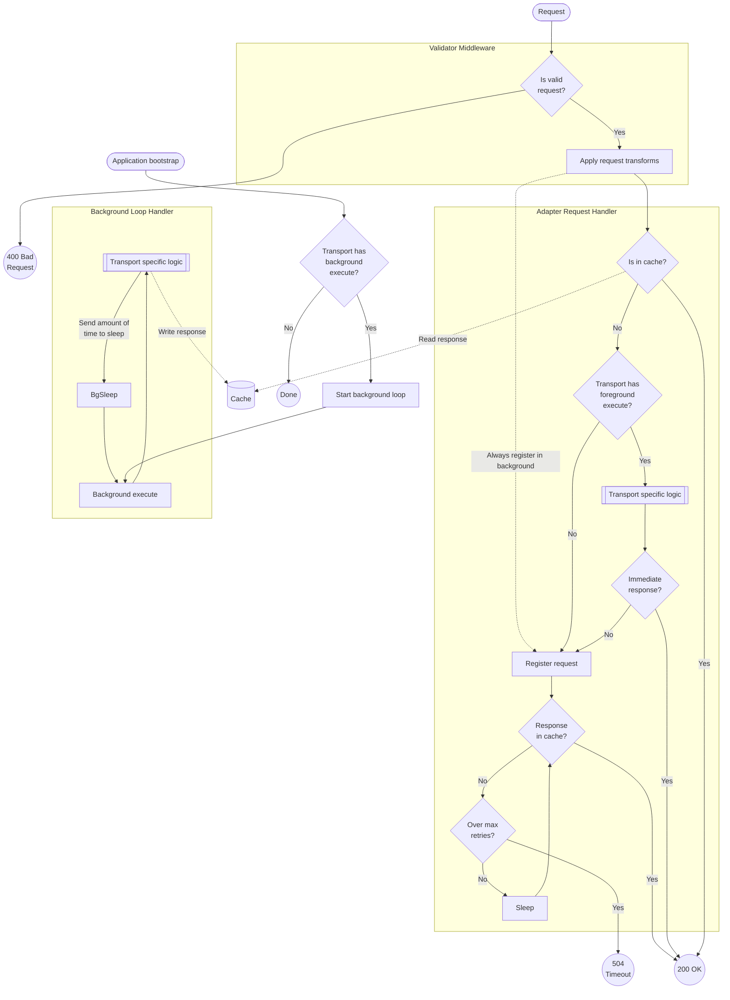

# EA Framework basics

This document covers some basic knowledge around External Adapters, what they are, and how they function.

## What's the purpose of EAs?

- Abstract provider specific details, specifically:
  - Transport (HTTP, WebSockets, RPC, SSE, etc.)
  - Authentication (login flows, keys)
  - Accept normalized request payloads and translate into the provider's interface (this also includes things like symbols/tickers)
  - Parse provider responses into the desired data points (e.g. price from crypto endpoint)
- Make the overall system more efficient by using as few resources (e.g. API credits, networking traffic, CPU usage) as possible to fetch data, achieved by features like:
  - Caching: since DPs update data at various times and a request to their API incurs a certain latency, EAs keep a cache of values to
    - Provide responses to the Chainlink Nodes as quickly as possible
    - Communicate with DPs only when necessary
  - Cache Warming: in order to make as many of the requests to EAs be fulfilled from the cache, EAs fetch values from DPs asynchronously to keep the local ones fresh.
  - Batching: the CL Node requests feeds individually, but it's common for DPs to provide batch endpoints to get many data points at once. With Batching, EAs keep track of incoming requests and consolidate them into one batched request.
  - Rate limiting: the EA framework additionally checks request rates (frequency) to make sure they fall within acceptable limits (like quotas for the DP's API, or adjusting based on the NOP's API tier).
- Perform off chain computations (think aggregations, indexing, or any sort of data processing)

By providing a framework that gives users easy access to those features, we reduce the complexity required for Nodes to communicate with DPs. By using EAs there is only one standardized way to do so, while optimizing said communication so it's as resource efficient as possible. It also makes internal and external development easier and faster, by serving as a strict guideline to implement and add new providers.

## EA v3 Design

The EA v3 design is built to provide all the features described above in an efficient and effective manner. The approach is best designed by showing the flow diagram for an incoming request into the EA:



This diagram shows the lifecycle of a request in the adapter. You'll notice that there are two separate processes that are connected only by interacting with the Cache. This is by design, so that from the same codebase we can split the process into a "Reader" (i.e. the REST API) and a "Writer" (i.e. the logic to fetch data from a provider). This provides several benefits, mainly to optimize requests to a provider and give us the ability to officially support horizontal scaling.

The second mechanism of note in that diagram is the **Transport** class. This is the main generic abstraction that the framework will use to structure the logic that will be run within the EA. It has three main components:

- **Request registration** (`registerRequest`): method that is always called when a valid incoming request reaches the adapter. It can be used for example to add those requests to a subscription set, that can be used later to do one batch request to the DP in the background. If there was a cached response already, this will be left to complete in the background and the response will be sent out first (to ensure that things like updating a subscription TTL happen regardless of the response).
- **Foreground execute** (`foregroundExecute`): synchronous method that is called if a response was not present in the cache. The request to the adapter will wait until this completes. If it provides a response, it's sent out immediately. If not, the cache polling mechanism kicks in to wait for results to be fetched from the background.
- **Background execute** (`backgroundExecute`): method called in the background handler loop. This is separate from the request flow, and only meant to share information through the cache. This is where most logic to fetch data from a provider should live.

## REST API

The EA REST API has only one endpoint, in the root of the used port (modified with the `EA_PORT` environment variable, `8080` by default).

It expects to receive an HTTP POST request, the body of which should carry the following format:

```jsonc
{
  "endpoint": "[[name]]",
  "data": {
    ... // Check the endpoint input parameters
  }
}
```

EAs have one or more "endpoints", which can provide different data from the data provider, and are selected by the `endpoint` property in the request body. The `data` property can accept different sets of information depending on the endpoint, and you should check the input parameters in the specific EA you're trying to communicate with.

## Metrics

EAs can expose metrics in the Prometheus format, enabled by setting the `METRICS_ENABLED` environment variable to `true`. They are enabled by default (we emphatically recommend that you set up metrics!) but can be disabled by setting the value to `false` instead.

## Types of Adapters

- **Source**: Adapters that connect to only one data provider.
- **Composite**: Adapters that connect to multiple data providers. Achieved using mulitple source adapters.
- **Non-Deployable**: Adapters used as dependencies for other adapters that are not mean to be ran independently.
