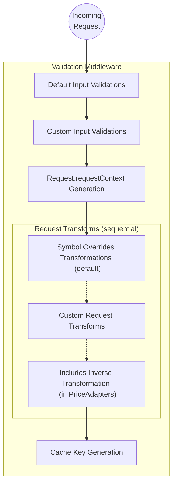

# Adapter

The adapter is initialized in the root-level `index.ts` file. It is configured using parameters set by the developer of the particular EA. These parameters are described in the sections below.

For EA's specific to retrieving price data, the framework provides a `PriceAdapter` class that standardizes types and has the added `includes` feature (covered [here](#includes)). The `PriceAdapter` class requires that at least one of the endpoints is a `PriceEndpoint` (covered in the [Endpoints Guide](./endpoints.md)).

## Default Endpoint

The default endpoint parameter is a string set to the name of one of the adapter endpoints. Requests will direct to this endpoint if the `endpoint` input parameter is not specified. The adapter will NOT fallback to this default if an incorrect endpoint name is explicitly defined in the request.

## Custom Settings

The v3 framework allows developers to define env vars that are specific to their EA. They should be defined in the `/config/index.ts` file in the format below.

If the EA does not require any custom env vars, this file can be ignored. Instead using the type `SettingsMap` from `@chainlink/external-adapter-framework/config`, where applicable, would be sufficient.

```typescript
import { AdapterConfig } from '@chainlink/external-adapter-framework/config'

export const config = new AdapterConfig({
  API_KEY: {
    description: '', // Description of the env var
    type: 'string', // What type should the value be
    options: ['foo', 'bar'], // If applicable, a list of valid options this env var could be set to
    default: 'foo', // If applicable, a default value
    validate: {
      meta: {},
      fn: () => {},
    }, // If applicable, a Validator object to validate the env var value. Return an error message for a failed validation, or undefined if it passes.
    required: true, // If the env var should be required. Default = false
    sensitive: false, // Set to false if the env var is safe to show uncensored in logs or telemetry. Default = true
  },
})
```

## Env Var Default Overrides

**Only use if absolutely necessary**

The adapter allows framework level env var defaults to be overriden. Framework level env vars have reasonable defaults already set so this parameter should not be needed for most adapters. Also, it should not be used to override defaults for custom settings since those should be specified directly in the custom settings object.

## Rate Limiting Tiers

Data provider specific rate limit tiers can be specified as one of the adapter parameters. They are defined by seconds, minutes, and/or hours. The tiers would then be selected using the `RATE_LIMIT_API_TIER` env var by setting it to the name of the tier.

## Overrides

Overrides are defined in the `/config/overrides.json` file. They allow input parameters to be overriden from a generic symbol to something more specific for the data provider such as an ID. An example of the format is below.

```json
{
  "adapterName": {
    "ETH": "1234"
  }
}
```

To understand where the overrides are applied, please refer to the [Request Validation & Transformation Diagram](#request-validation--transformation)

## Includes

The includes list, defined in the `/config/includes.json` file, is a parameter only for the `PriceAdapter`. In the v3 framework's current implementation, it is only used for inverses. This feature allows data to be retrieved for the inverse of pairs that a data provider does not support.

The most common example of this is for foreign exchange rates. Some data providers will only support pairs in one direction such as USD/JPY but not JPY/USD. To provide data for both directions, we can add an entry for this pair in the includes list like below. This will allow the adapter to retrieve data for USD/JPY instead and return (1 / result) when the request is for JPY/USD.

```json
[
  {
    "from": "JPY",
    "to": "USD",
    "includes": [
      {
        "from": "USD",
        "to": "JPY",
        "inverse": true
      }
    ]
  }
]
```

To understand where the inverses are applied, please refer to the [Request Validation & Transformation Diagram](#request-validation--transformation)

## Request Transforms

**Only use if absolutely necessary**

Request transforms is an array of functions that allow the transformation of input parameters. The functions are provided with the incoming `AdapterRequest` object that can be altered and passed on to either another function or the rest of the adapter's logic.

Below is an example of a request transform function that uses the incoming request and transforms it by replacing `base` and `quote` with a new `hash` field.

Note: This component should not be used for overrides and inverses.

```typescript
export const requestTransform = (
  req: AdapterRequest<TypeFromDefinition<typeof inputParameters.definition>>,
): void => {
  const base = req.requestContext.data.base
  const quote = req.requestContext.data.quote
  if (base && quote) {
    req.requestContext.data.hash = hash(`${base}${quote}`)
    delete req.requestContext.data.base
    delete req.requestContext.data.quote
  }
}
```

To understand where these transformation apply, please refer to the [Request Validation & Transformation Diagram](#request-validation--transformation)

## Bootstrap Function

**Only use if absolutely necessary**

The bootstrap function is custom logic a developer can specify to run at the startup of the adapter.

One use case, shown below, is to perform validations on combinations of env vars. An error is thrown on failure to halt the adapter startup.

```typescript
export const adapter = new Adapter({
  ...
  bootstrap: async (adapter: Adapter<typeof customSettings>) => {
    if (adapter.config.WS_ENABLED && !adapter.config.WS_API_KEY) {
      throw 'WS_API_KEY is required when WS_ENABLED is set to true'
    }
  },
  ...
})
```

## Test Payload

The test payload is not specified as a parameter for an adapter. It is defined in the `test-payload.json` file in the root-level of the adapter folder. It is used for soak testing the adapter. An example of this file is shown below.

```json
{
  "requests": [
    {
      "base": "ETH",
      "quote": "USD"
    },
    {
      "base": "JPY",
      "quote": "USD",
      "endpoint": "forex"
    }
  ]
}
```

## Request Validation & Transformation

This diagram expands on the `Validation Middleware` section of the `EA v3 Design` diagram in [Basics](../basics.md#ea-v3-design)


